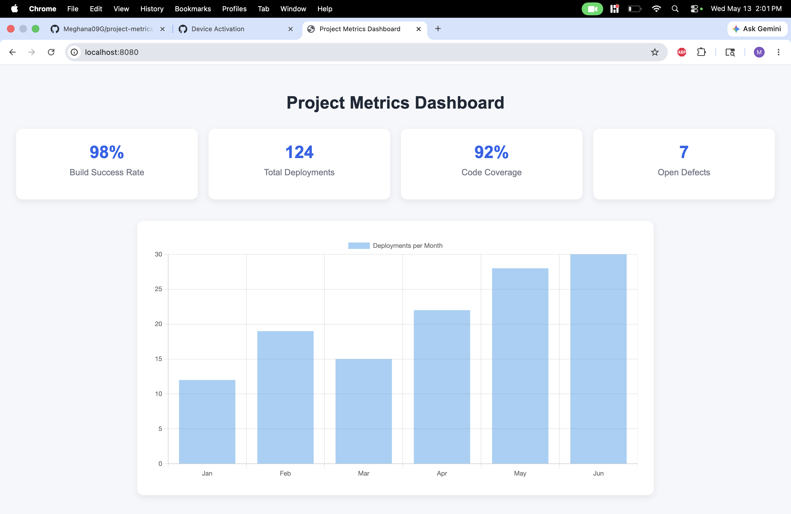

# Project Metrics Dashboard

A production-style Java Spring Boot application that visualizes software engineering KPIs through an interactive web dashboard. The application displays build success rate, deployment frequency, code coverage, and open defects to provide a consolidated view of software delivery health.

---

## Dashboard Preview



---

## About the Project

### Problem Statement

Engineering teams rely on key performance indicators (KPIs) to monitor software delivery and operational quality. Metrics such as deployment frequency, build success rate, code coverage, and defect counts help teams measure productivity, stability, and code health.

This project provides a web-based dashboard that presents these metrics in a clean and intuitive format, enabling stakeholders to quickly assess project status.

### Objective

The goal of this project is to demonstrate how a Java Spring Boot application can be used to build a lightweight analytics dashboard using MVC architecture and server-side rendering with Thymeleaf.

---

## Key Features

- Displays build success rate
- Tracks total deployments
- Shows code coverage percentage
- Monitors open defect count
- Visualizes monthly deployment trends using charts
- Responsive and clean dashboard UI
- Professional GitHub documentation with image previews

---

## Metrics Displayed

| Metric | Value |
|------:|------:|
| Build Success Rate | 98% |
| Total Deployments | 124 |
| Code Coverage | 92% |
| Open Defects | 7 |

---

## Technology Stack

### Backend
- Java 17
- Spring Boot 3.x
- Spring MVC

### Frontend
- Thymeleaf
- HTML5
- CSS3
- Chart.js

### Build Tools
- Maven

### Version Control
- Git
- GitHub

---

## Application Architecture

The application follows the Model-View-Controller (MVC) design pattern.

### Controller Layer
Processes HTTP requests and supplies dashboard metrics to the view.

### View Layer
Uses Thymeleaf templates to render HTML pages dynamically.

### Static Resources
Contains images, CSS, and JavaScript assets.

### Build Layer
Maven manages dependencies and packaging.

---

## Project Structure

```text
project-metrics-dashboard/
├── src/
│   ├── main/
│   │   ├── java/
│   │   │   └── com/meghana/dashboard/
│   │   │       ├── ProjectMetricsDashboardApplication.java
│   │   │       └── ProjectMetricsController.java
│   │   └── resources/
│   │       ├── templates/
│   │       │   └── index.html
│   │       ├── static/
│   │       │   └── images/
│   │       │       └── dashboard.png
│   │       └── application.properties
├── pom.xml
└── README.md